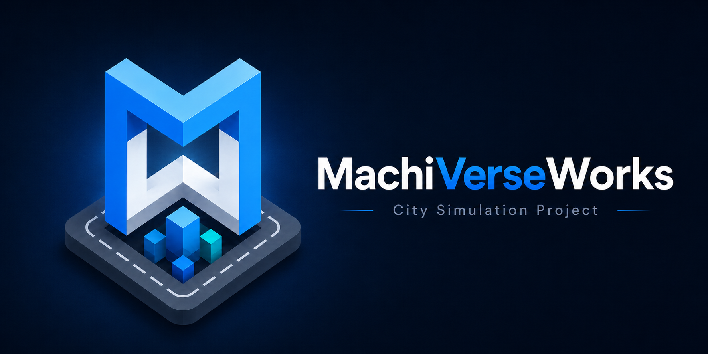

<p align="center">
  
</p>

<h1 align="center">MachiVerseWorks</h1>

<p align="center">
  <strong>City Simulation Project</strong><br>
  C#製ヘッドレス・シミュレーションサーバーとブラウザ3Dクライアントで構成する、大規模リアルタイム都市シミュレーション。
</p>

<p align="center">
  <a href="https://github.com/SUIREN-KazutoHashimoto/MachiVerseWorks/actions/workflows/ci.yml"></a>
  <a href="LICENSE"></a>
  
  
</p>

<p align="center">
  
</p>

## MachiVerseWorks とは

MachiVerseWorks は、市民・道路交通・公共交通・物流・産業・電力などの都市活動を、サーバー側で継続的にシミュレーションする都市シミュレーションプロジェクトです。

旧 Machi-Sim で得られたドメイン・設計・性能面の知見を引き継ぎつつ、ブラウザ単体実装からシミュレーション本体を分離しています。Clientは必要な3D空間範囲だけを購読し、Serverがauthoritative world、Protocolがwire contract、Persistenceがversioned Save Data境界を担当します。

> [!NOTE]
> 現在は **pre-alpha** 段階です。実装・API・Protocol・Save format・仕様は開発の進行に伴って変更される可能性があります。

## Current baseline

- Application version: ルート[`VERSION`](VERSION)を正本とする
- Protocol: **2.9**
- Save format: **10**
- Phase 17 Railway Infrastructure: ✅ 完了
- Phase 18 Railway Operations: ✅ 完了
- Phase 19 Multimodal Transit: ✅ 完了
- Phase 20 Server Administration Console: ⏭️ 次

詳細なPhase / Task状態は[`ROADMAP.md`](ROADMAP.md)だけを進捗の正本とし、READMEへ全Task一覧を複製しません。

## Architecture

```text
┌──────────────────────────────┐
│      Browser 3D Client       │
│  TypeScript / Three.js       │
└──────────────┬───────────────┘
               │ Protocol 2.9 / WebSocket
┌──────────────▼───────────────┐
│     MachiVerseWorks.Server   │
│ lifecycle / command / I/O    │
└──────────────┬───────────────┘
               │
┌──────────────▼───────────────┐
│  MachiVerseWorks.Simulation  │
│ authoritative world state    │
└──────────────▲───────────────┘
               │ checkpoint mapping
┌──────────────┴───────────────┐
│ MachiVerseWorks.Persistence  │
│ Save Format 10 / validation  │
└──────────────────────────────┘

MachiVerseWorks.Protocol = Client / Server binary contract
```

| Component | Responsibility |
| --- | --- |
| **Simulation** | fixed-tick authoritative world、Agent / Road / Traffic / Population / Railway / Multimodal Transit |
| **Persistence** | Simulation checkpointとversioned Save Dataのmapping、外部Save validation |
| **Server** | 実行lifecycle、接続、command、3D subscription、snapshot配信、I/O境界 |
| **Protocol** | Client / Server間のstable ID・version negotiation・binary layout |
| **Web Client** | 3D描画、補間、debug UI、audio、localization |

設計の詳細は[`docs/architecture/overview.md`](docs/architecture/overview.md)、Protocolのbinary正本は[`docs/architecture/protocol.md`](docs/architecture/protocol.md)、Save仕様は[`docs/specifications/save-data.md`](docs/specifications/save-data.md)を参照してください。採用理由は[`ADR-0001`](docs/decisions/ADR-0001-csharp-headless-simulation-server.md)に記録しています。

## Design Principles

- **Server authoritative** — Web ClientにSimulationの正本を持たせない
- **Spatial subscription** — Clientには必要な3D範囲だけを配信する
- **Separated clocks** — Simulation tick / snapshot publish / render frameを分離する
- **Measure first** — 最適化はprofiler・benchmark・実測値に基づく
- **Stable data contracts** — Protocol / Save Dataへ表示言語やUI文字列を混ぜない
- **Explicit versioning** — Application / Protocol / Save formatを独立してversioningする
- **Small, completable tasks** — 単独で実装・検証・完了できるTask ID単位で進める

## Implemented simulation domains

現在の基盤には、3D Agent / Building / POI、Road Network / Routing / Road Traffic / Intersection Control、Pedestrian、Population daily activity、Railway Infrastructure、Railway Operations、Multimodal Transit（Walk / Bus / Taxi / Railway）が含まれます。

仕様入口は[`docs/specifications/README.md`](docs/specifications/README.md)、実装境界は[`docs/architecture/README.md`](docs/architecture/README.md)を参照してください。

## Repository

```text
MachiVerseWorks/
├─ src/
│  ├─ MachiVerseWorks.Simulation/
│  ├─ MachiVerseWorks.Persistence/
│  ├─ MachiVerseWorks.Server/
│  ├─ MachiVerseWorks.Protocol/
│  └─ web/
├─ tests/
├─ benchmarks/
├─ assets/
├─ docs/
│  ├─ product/
│  ├─ architecture/
│  ├─ specifications/
│  ├─ development/
│  ├─ decisions/
│  └─ archive/
├─ scripts/
├─ tools/
├─ .github/
├─ global.json
├─ VERSION
├─ ROADMAP.md
├─ AGENTS.md
└─ README.md
```

## Development

.NET SDKはルートの[`global.json`](global.json)を正本として固定し、現在は **.NET 10** 系を採用しています。Web Clientは **TypeScript + Three.js** です。

主要な開発ドキュメント:

- [AGENTS.md — 開発・エージェント運用ルール](AGENTS.md)
- [Coding Guidelines](docs/development/coding-guidelines.md)
- [Performance Guidelines](docs/development/performance.md)
- [CI / GitHub Actions](docs/development/ci.md)
- [Git workflow](docs/development/git-workflow.md)
- [Versioning](docs/development/versioning.md)

## Documentation

| Directory | Purpose |
| --- | --- |
| [`docs/product/`](docs/product/) | プロジェクトの目的・概念・用語 |
| [`docs/architecture/`](docs/architecture/) | システム構成と技術設計 — **How** |
| [`docs/specifications/`](docs/specifications/) | Simulationの振る舞い — **What / Why** |
| [`docs/development/`](docs/development/) | 開発・テスト・Git・CI・version運用 |
| [`docs/decisions/`](docs/decisions/) | Architecture Decision Record |
| [`docs/archive/`](docs/archive/) | Legacy資料・廃止済み設計・実験記録 |

ドキュメント全体の索引は[`docs/README.md`](docs/README.md)を参照してください。

## Legacy

旧ブラウザ単体版は[`Machi-Sim_Legacy`](https://github.com/SUIREN-KazutoHashimoto/Machi-Sim_Legacy)として保存しています。

旧実装をそのまま移植するのではなく、必要なドメイン仕様・設計知見を選別し、新しいServer-authoritative architectureに合わせて再設計します。移行方針は[`docs/archive/legacy-machi-sim/README.md`](docs/archive/legacy-machi-sim/README.md)に記録しています。

## Contributing / Security

- 貢献方法: [`CONTRIBUTING.md`](CONTRIBUTING.md)
- 行動規範: [`CODE_OF_CONDUCT.md`](CODE_OF_CONDUCT.md)
- 脆弱性報告: [`SECURITY.md`](SECURITY.md)

## License

MachiVerseWorks は **Apache License 2.0** の下で提供します。

- [`LICENSE`](LICENSE)
- [`NOTICE`](NOTICE)
- [`THIRD_PARTY_NOTICES.txt`](THIRD_PARTY_NOTICES.txt)
